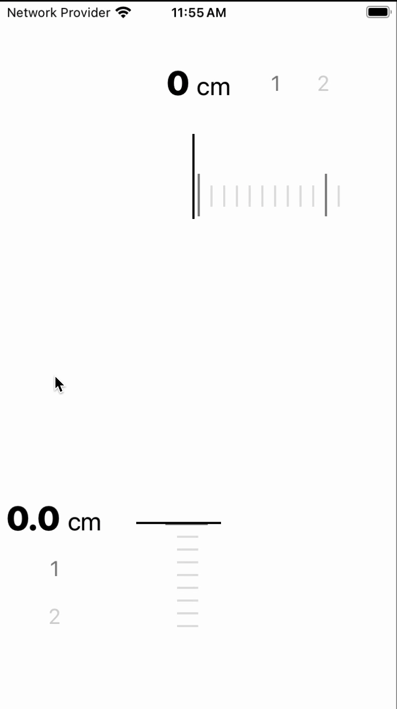

# react-native-library

[](https://www.npmjs.com/package/react-native-library) [](http://hits.dwyl.com/rnheroes/react-native-library)

⚡ Lightning-fast and highly customizable Ruler Picker component for React Native with vertical and horizontal support.



## Installation

1. `yarn add react-native-library` or `npm install react-native-library`

## Usage

```js
import { RulerPicker } from 'react-native-library';

<RulerPicker
  min={0}
  unit="cm"
  max={240}
  step={1}
  height={300}
  fractionDigits={0}
  initialValue={0}
  onValueChange={(number) => console.log('onValueChange', number)}
  onValueChangeEnd={(number) => console.log('onValueChangeEnd', number)}
/>;
```

## Props

### RulerPickerProps
| Name                | Type                            | Required | Default Value | Description                              |
|---------------------|---------------------------------|----------|---------------|------------------------------------------|
| width               | number                         | No       | windowWidth   | Width of the ruler picker                |
| height              | number                         | No       | 500           | Height of the ruler picker               |
| min                 | number                         | Yes      | -             | Minimum value of the ruler picker        |
| max                 | number                         | Yes      | -             | Maximum value of the ruler picker        |
| step                | number                         | No       | 1             | Step of the ruler picker                 |
| initialValue        | number                         | No       | min           | Initial value of the ruler picker        |
| fractionDigits      | number                         | No       | 1             | Number of digits after the decimal point |
| unit                | string                         | No       | 'cm'          | Unit of the ruler picker                 |
| indicatorHeight     | number                         | No       | 80            | Height of the indicator                  |
| vertical            | boolean                        | No       | false         | Enables vertical orientation             |
| theme               | RulerTheme or ThemeName        | No       | -             | Theme for the ruler picker               |
| hapticFeedback      | boolean                        | No       | false         | Enables haptic feedback                  |
| animated            | boolean                        | No       | false         | Enables animation                        |
| valueTextStyle      | TextStyle                      | No       | -             | Text style of the value                  |
| unitTextStyle       | TextStyle                      | No       | -             | Text style of the unit                   |
| decelerationRate    | 'fast' \| 'normal' \| number   | No       | 'normal'      | Deceleration rate of the ruler picker    |
| accessibility       | RulerAccessibilityConfig       | No       | -             | Accessibility configuration              |
| showLabels          | boolean                        | No       | false         | Show labels                              |
| animationConfig     | AnimationConfig                | No       | -             | Animation configuration                  |
| onValueChange       | (value: number) => void        | No       | -             | Callback when the value changes          |
| onValueChangeEnd    | (value: string) => void        | No       | -             | Callback when the value changes end      |

### RulerPickerItemProps
| Name               | Type                            | Required | Default Value | Description                              |
|--------------------|---------------------------------|----------|---------------|------------------------------------------|
| gapBetweenSteps    | number                         | No       | 10            | Gap between steps                        |
| shortStepHeight    | number                         | No       | 20            | Height of the short step                 |
| longStepHeight     | number                         | No       | 40            | Height of the long step                  |
| stepWidth          | number                         | No       | 2             | Width of the steps                       |
| shortStepColor     | string                         | No       | 'lightgray'   | Color of the short steps                 |
| longStepColor      | string                         | No       | 'darkgray'    | Color of the long steps                  |
| vertical           | boolean                        | No       | false         | Enables vertical orientation             |
| containerStyle     | ViewStyle                      | No       | -             | Style of the container                   |
| stepStyle          | ViewStyle                      | No       | -             | Style of the steps                       |
| showLabels         | boolean                        | No       | false         | Show labels                              |
| renderLabel        | (value: number) => ReactNode   | No       | -             | Custom renderer for labels               |
| animationConfig    | AnimationConfig                | No       | -             | Animation configuration                  |
| theme              | RulerTheme or ThemeName        | No       | -             | Theme for the ruler picker               |

### RulerTheme
| Name              | Type   | Required | Default Value | Description                          |
|-------------------|--------|----------|---------------|--------------------------------------|
| indicatorColor    | string | No       | 'black'       | Color of the center line             |
| shortStepColor    | string | No       | 'lightgray'   | Color of the short steps             |
| longStepColor     | string | No       | 'darkgray'    | Color of the long steps              |
| textColor         | string | No       | 'black'       | Text color                           |
| backgroundColor   | string | No       | 'white'       | Background color                     |

### AnimationConfig
| Name            | Type                            | Required | Default Value | Description                              |
|-----------------|---------------------------------|----------|---------------|------------------------------------------|
| duration        | number                         | No       | -             | Duration of the animation                |
| type            | 'spring' \| 'timing'          | No       | 'timing'      | Type of the animation                    |
| springConfig    | { tension, friction }          | No       | -             | Configuration for spring animations      |

### RulerAccessibilityConfig
| Name                 | Type                            | Required | Default Value | Description                              |
|----------------------|---------------------------------|----------|---------------|------------------------------------------|
| enabled              | boolean                        | No       | false         | Enables accessibility                    |
| labelFormat          | string                         | No       | -             | Format for accessibility labels          |
| announceValues       | boolean                        | No       | false         | Announce values during adjustment        |
| minimumAdjustment    | number                         | No       | -             | Minimum adjustment value                 |
| incrementAnnouncement| string                         | No       | -             | Announcement for increment action        |
| decrementAnnouncement| string                         | No       | -             | Announcement for decrement action        |

## Contributing

This library is forked from the original [react-native-ruler-picker](https://github.com/rnheroes/react-native-ruler-picker) repository, and full credit goes to them. This is my first npm package, so there might be bugs. Let’s use it, find and fix issues, and add new features together!

See the [contributing guide](CONTRIBUTING.md) to learn how to contribute to the repository and the development workflow.

## License

MIT

---

Made with [create-react-native-library](https://github.com/callstack/react-native-builder-bob)
